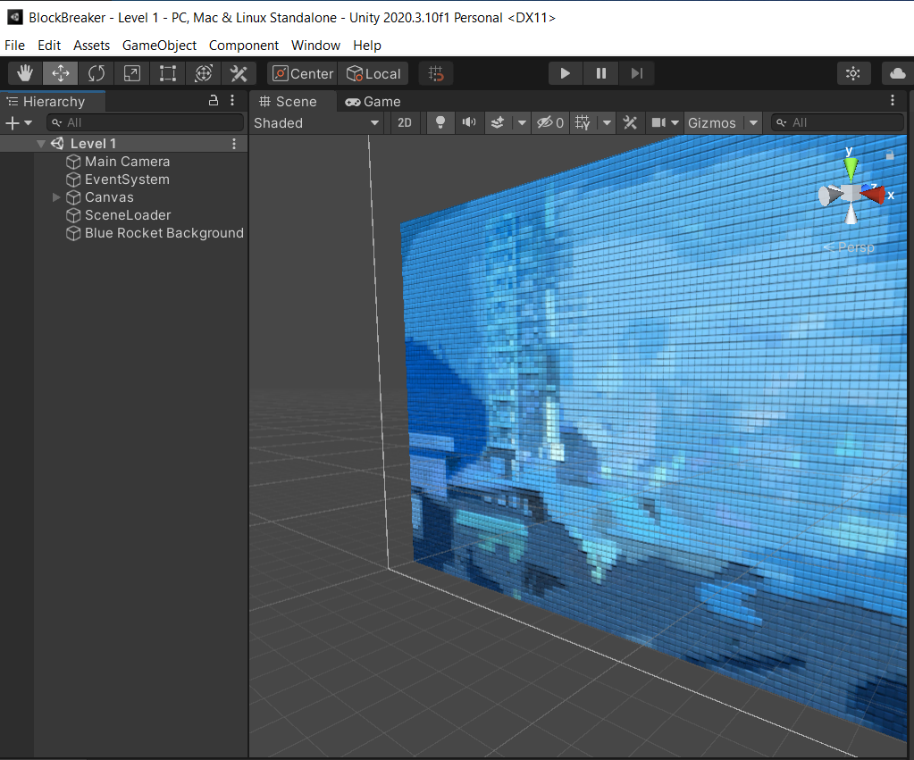

## DEV-02, World Units:
Created a new folder called Sprites to hold sprites within the LEVEL 1 scene

### Orthographic Camera:
Size is half the total height of the camera.
So if the camera size 3 then from the middle of the camera, 3 units up and three units down is the total height. 
Our default camera size is size 5, 

### Pivot Point
We change the pivot point of our sprite.
We want our sprite's bottom left and the camera's bottom left to be same.

### Pixels Per Unit

### Push Back Background in Z

### Manage Size For Sprites
