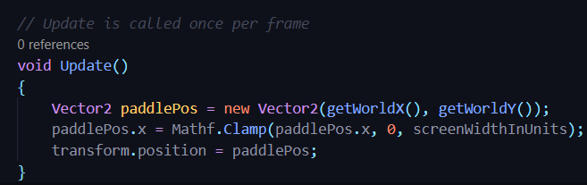

## DEV-07, Limiting mouse movement with Mathf.Clamp():
We wantto make sure that the paddle does not go off the screen with our mouse.
We will restrict it to the ui view of the game.

Documentation for Mathf.Clamp
https://docs.unity3d.com/ScriptReference/Mathf.Clamp.html

Using Mathf.Clamp to stop the paddle going off the screen

