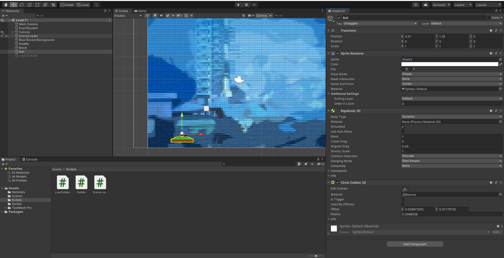
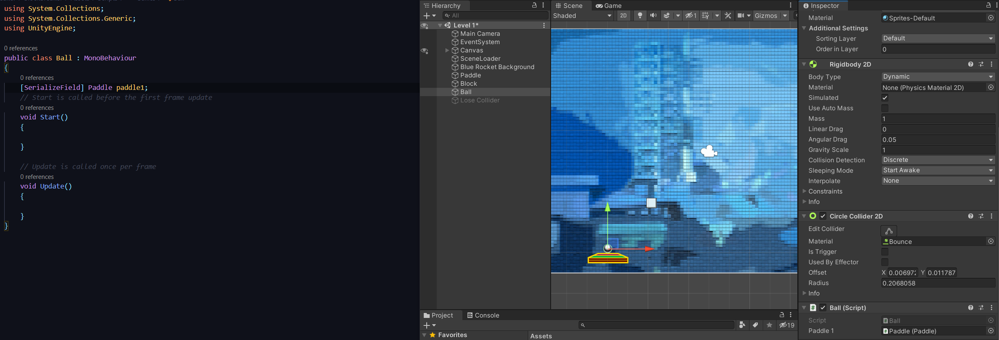
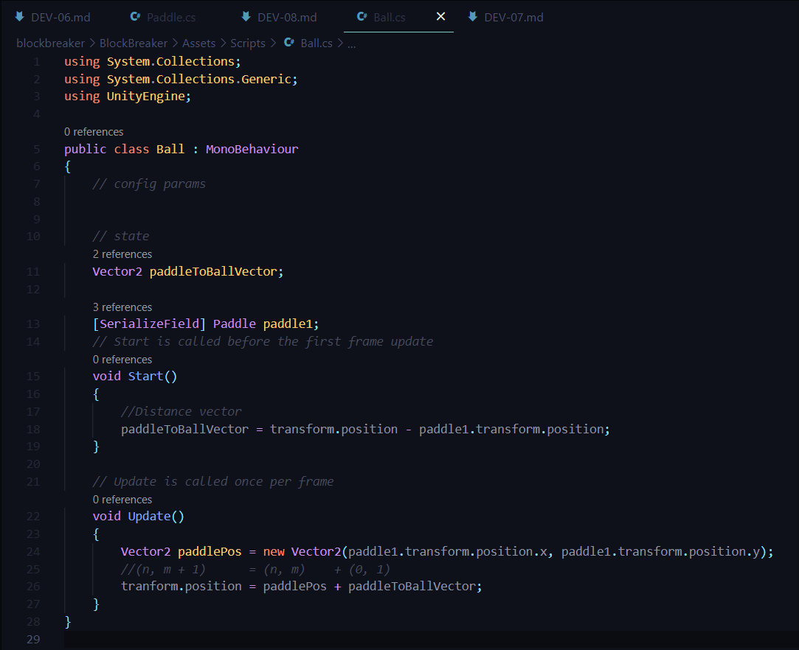
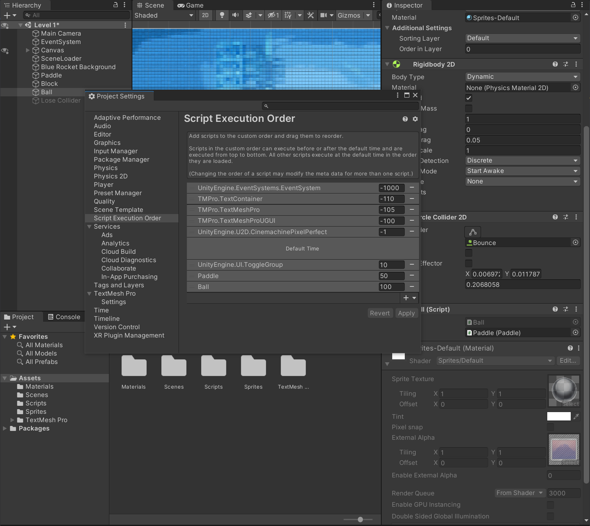

## DEV-08, Distance as a Vector2:
We want to glue the ball to the paddle as we move it so that the user can select where they want the ball to shoot to
This is an introduction on how to use vectors between to unity objects to interact with on another

Edit > Project Settings
We want to make sure that the script for the paddle is executed first
