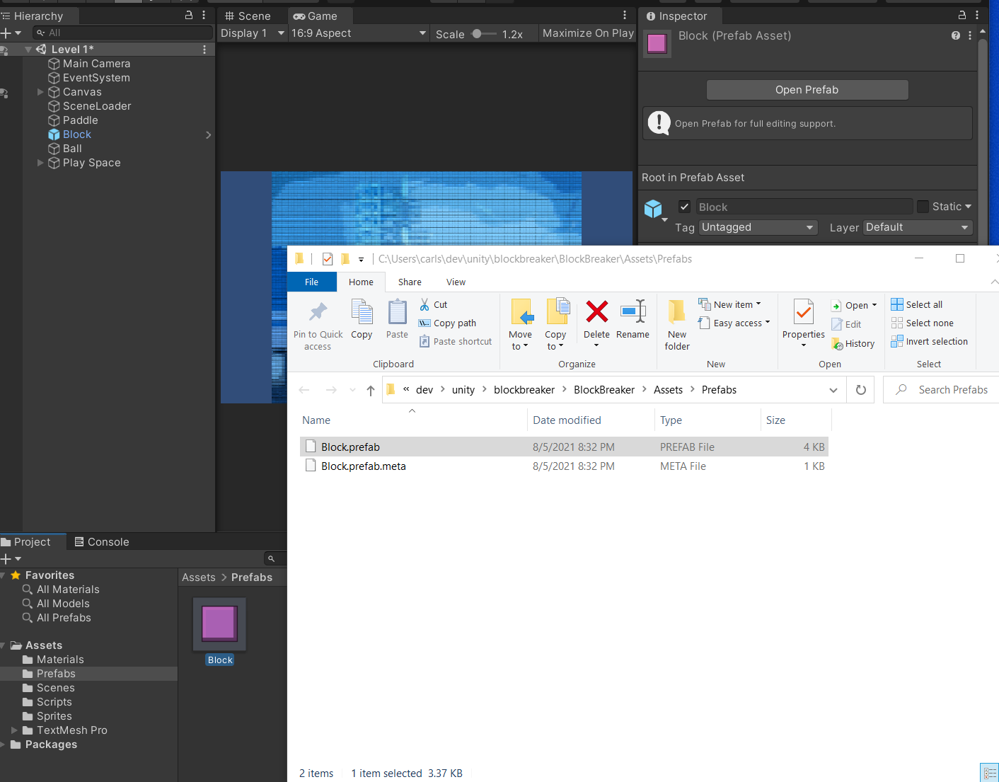
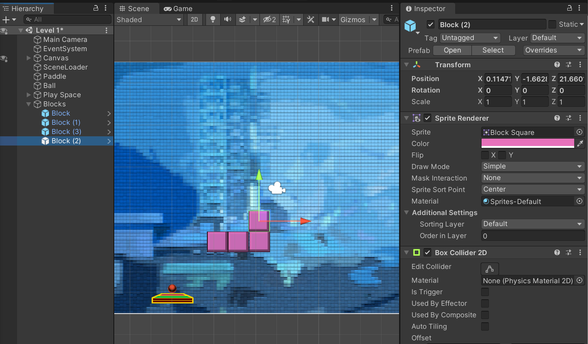
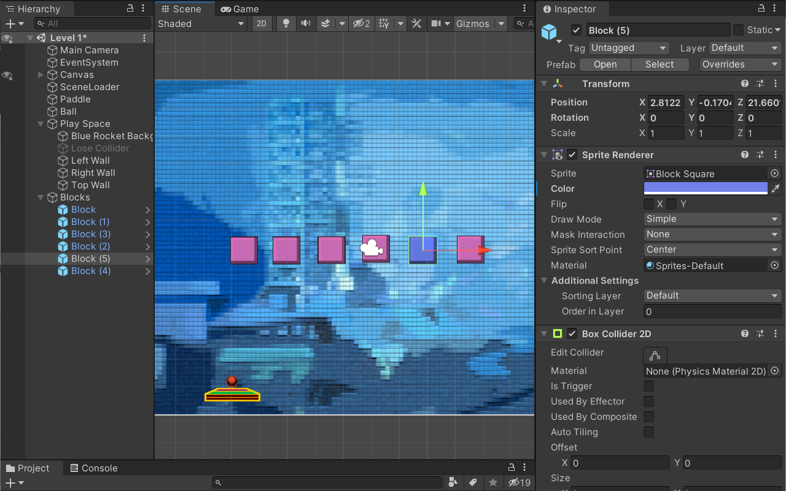
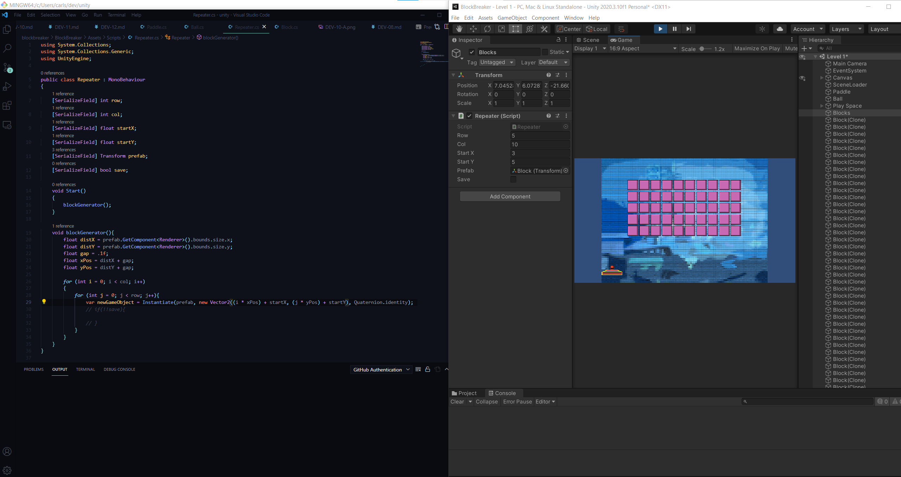

## DEV-12, Replicate blocks

A prefab is a template for other objects to use
create one game object, in our case the block
create one folder called prefabs
then drag the block to the prefabs folder
then use that block from prefabs and drop it into your scene

I had an issue where the scene would disappear when I zoomed in too much.
to fix that, select the object you want to work on, and press F. This focusses the screen on the object you selected.

You can tell if something is a prefab if it is in the color blue;

right click reimport to reflect changes that are shown are the instances but not shown on the prefab folder's version.

bold indicates that its property is different from the prefab
If a think has a property that is identical to the prefab, it will map together with the prefab with anything else that matches

to snap things to a grid
HOLD DOWN V ON THE KEYBOARD ONCE YOU SELECTED YOU OBJECT TO SNAP VERTEXES TOGETHER

learned how to use template strings in C#
var template = $"Your job finished at {FinishTime} and your file is available for download at {FileURL}."

link for learning how to duplicate prefabs:
https://docs.unity3d.com/ScriptReference/PrefabUtility.InstantiatePrefab.html

AutoGenerate blocks
