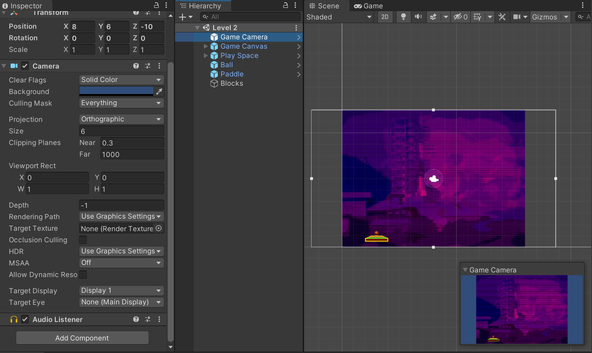
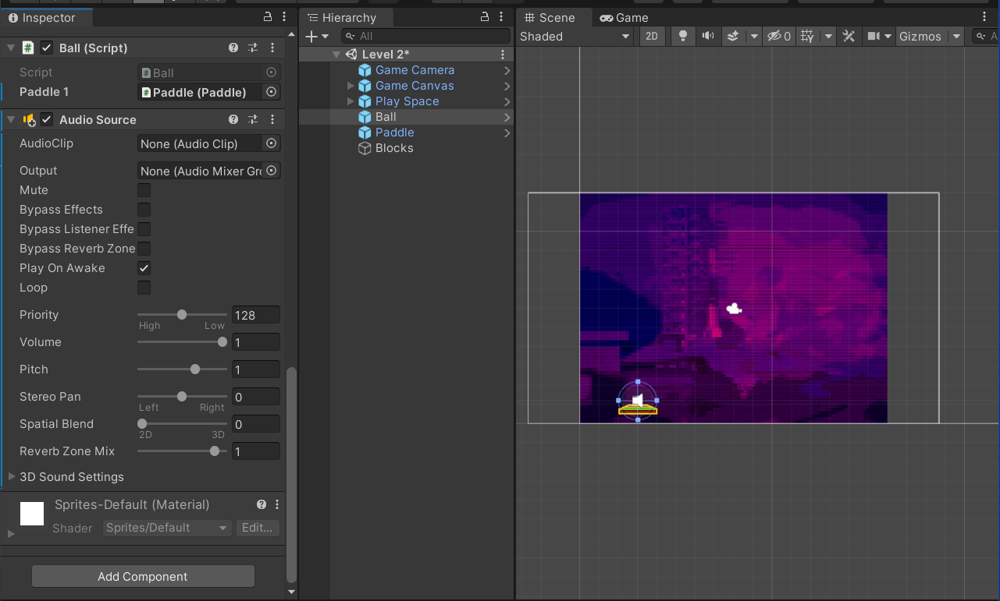

## DEV-15, Playing with Audio

Audio Listener - hearing the sound
Audio Source - playing the sound
Audio clip - the sound

your camera is generally where you audio listener is

The reason for this is that it is possible to have sound at a specific distance away from the camera

We are going to add an audio source to the ball which will play the sound

https://docs.unity3d.com/Manual/AudioFiles.html
https://docs.unity3d.com/560/Documentation/Manual/class-AudioSource.html

ogg files are lightweight and have beter quality than mp3, never do wav

Play on awake is when the object is rendered, the sound wil play, thats good for music

### How to access components
GetComponent<AudioSource>
GetComponent<Rigidbody2D>

### Turning off icons
Gizmos > uncheck 3D icons
