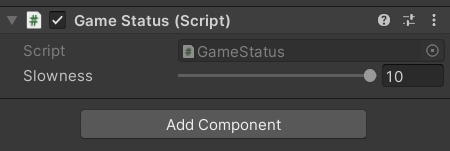
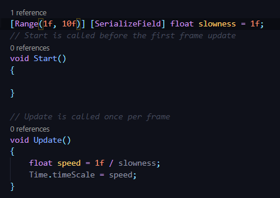
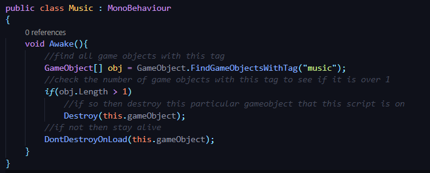

## DEV-20, Using Time.timeScale, updating music

We are doing this so that we can manage the speed of the game

https://docs.unity3d.com/ScriptReference/Time-timeScale.html

### How to incorporate a slider and make things slower

We replaced the prefab of level with the current one also

We also reworked the music component since i didnt like that the music reset after each level was reached. this ensures that the original gameObject for music doesnt break until whenever we decide to say so.

