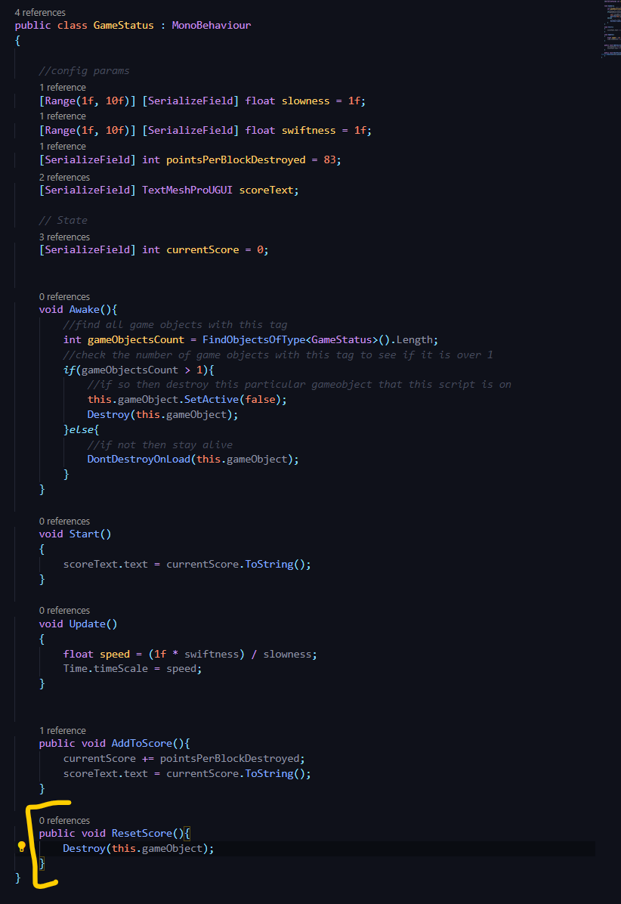
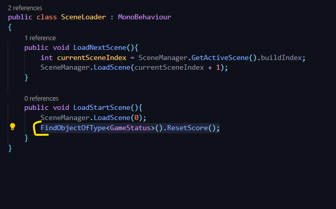
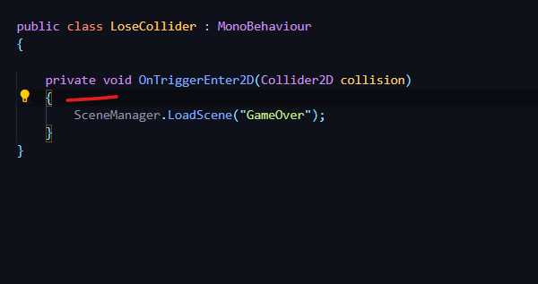
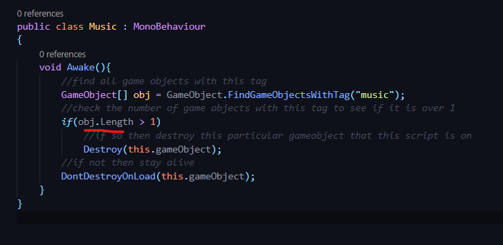

## DEV-24, Resolving State reset when a scene is hit

remove this line of code `FindObjectOfType<GameStatus>().ResetScore();` from LoseCollider

removed this line of code `this.gameObject.SetActive(false);` to get music running again at start up

We also renamed GameStatus to GameSession within the 
scripts reference code
scripts name in unity
object reference in the Hierarchy via the prefab