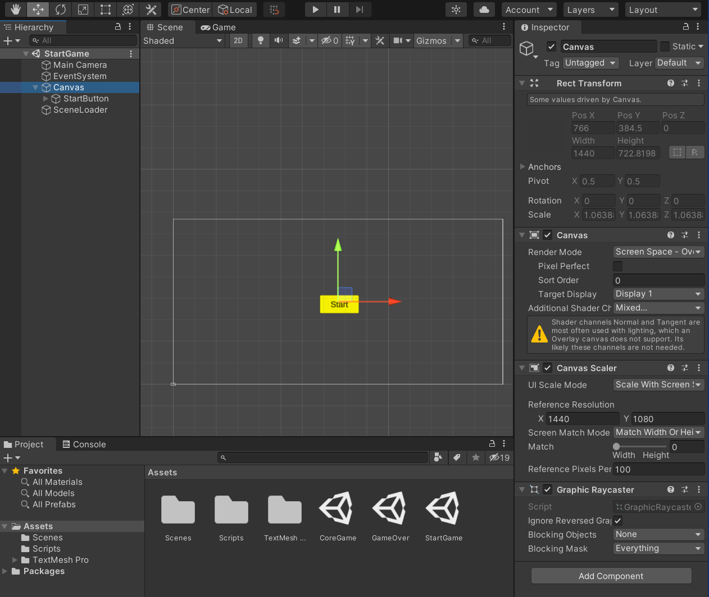
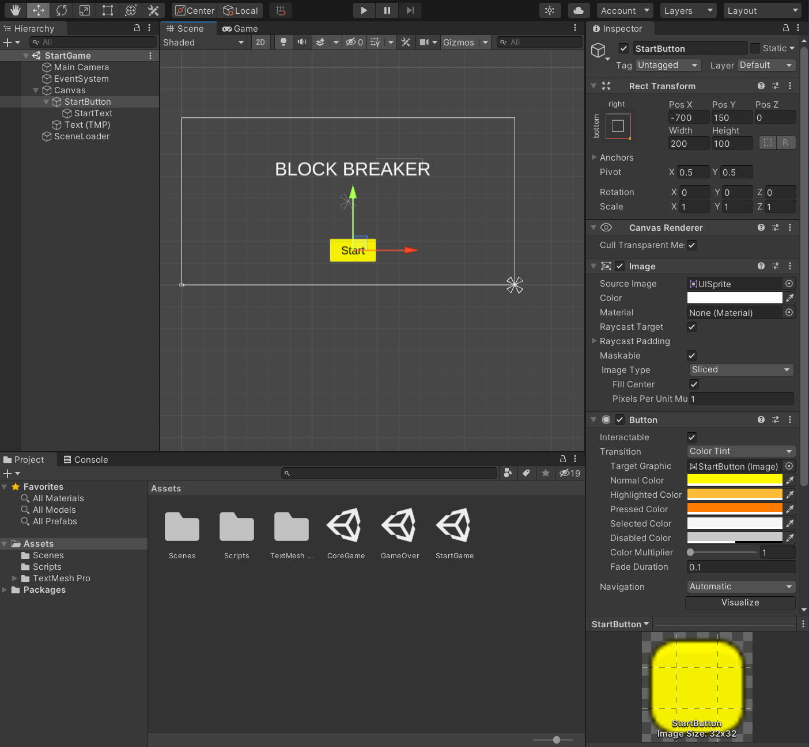
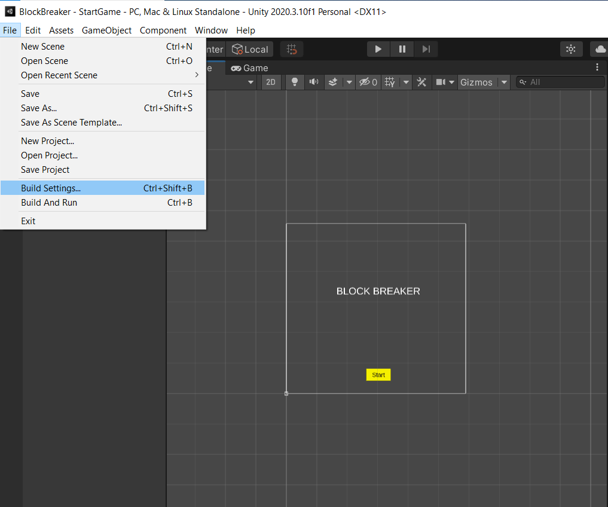
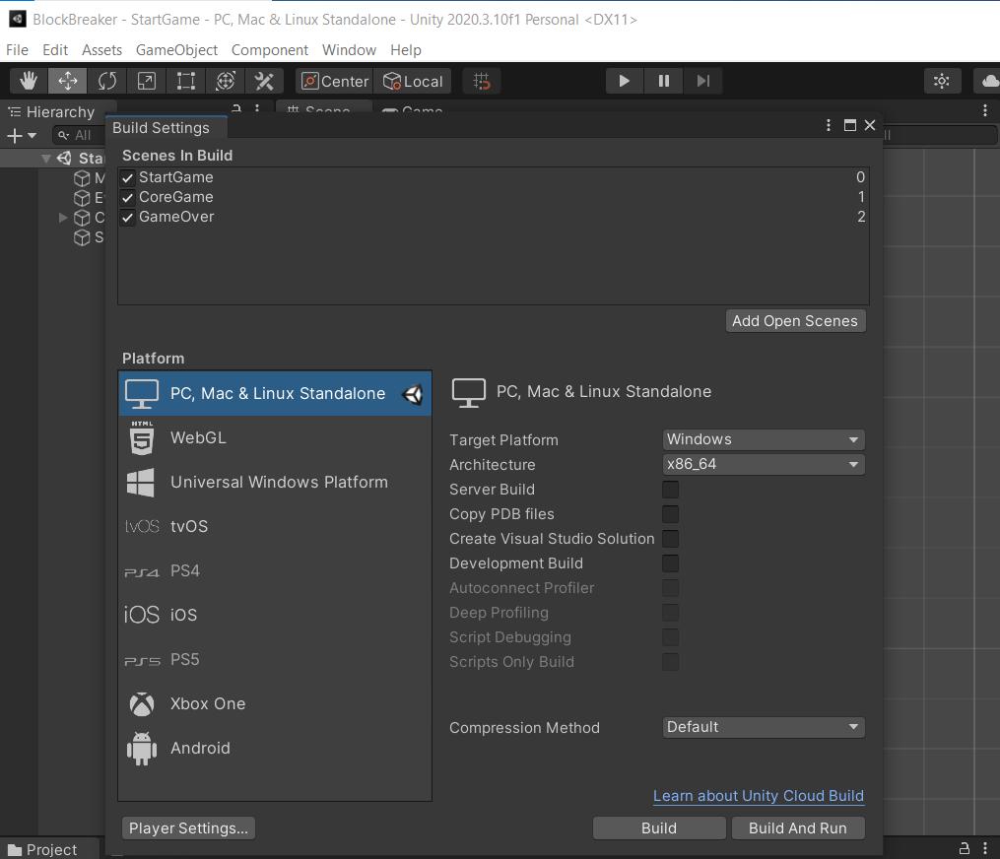

## DEV-01, Importing Assets:
We reimported scenes from NumberWizard.
We deleted old images
Rearranged positions of buttons
changed the aspect ratio on Canvas Reference Resolution 
on:
- StartGame 
- GameOver
- CoreGame

How to change aspect ratio

Added a font size 80 title via textMeshPro by right clicking Canvas > UI > Text - TextMeshPro

Adjusted Buttons to have a standard size

We also updated the build index for the scens so that they can work properly
You need to drag and drop your scenes into the menu in the order you want them. No need to Build, just x out.

Made sure to update the names of the components