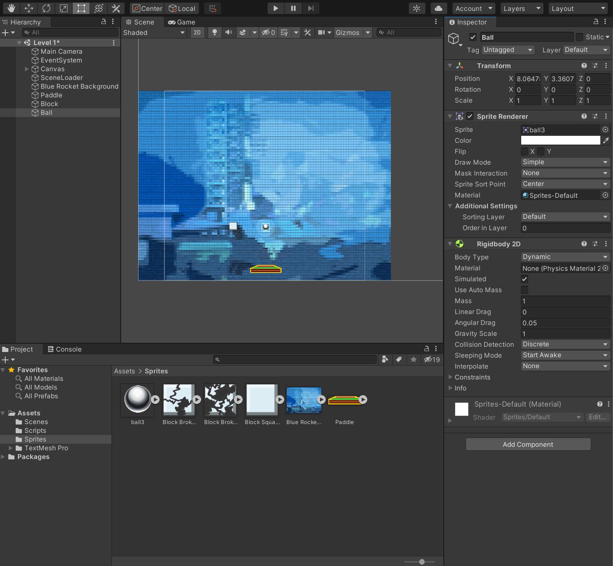
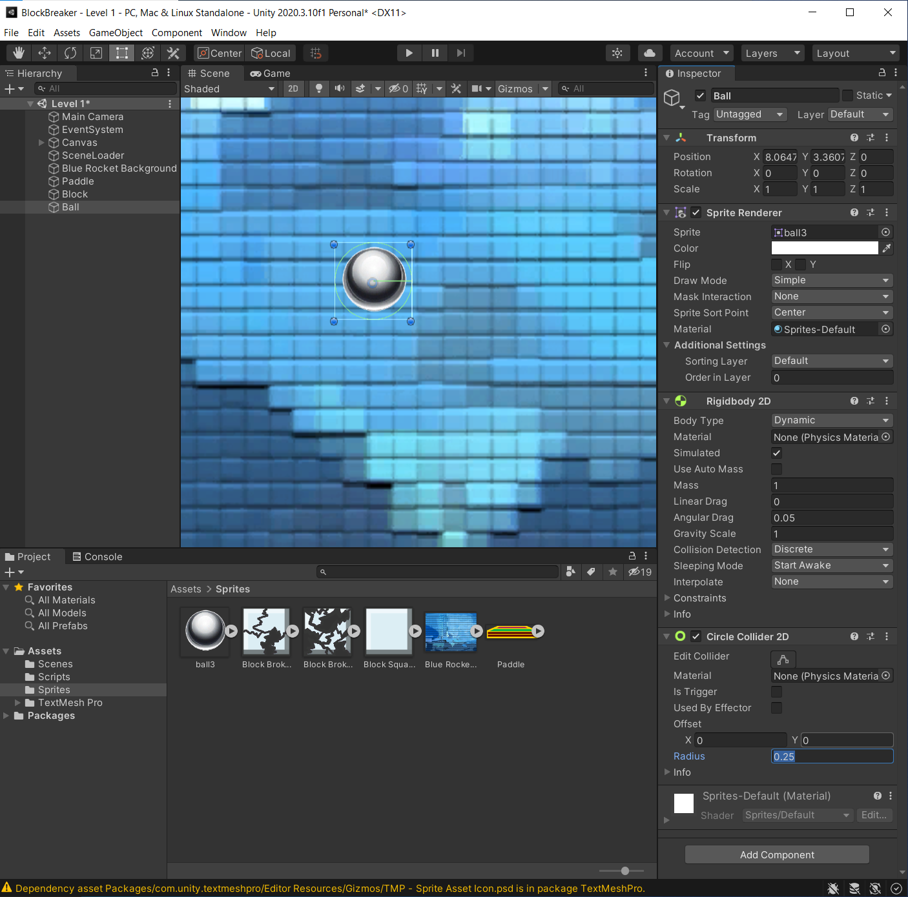

## DEV-03, Rigidbody & Colliders:
Adding a Rigidbody2D so that our ball will drop.
Adding a Collider for collision.

https://docs.unity3d.com/Manual/Collider2D.html
https://docs.unity3d.com/Manual/class-Rigidbody2D.html

### Adding a RigidBody

#### Dynamic
Subject to gravity and other forces. Engine controls movement

#### Kinematic
Not subject to gravity. Other forces can bounce off it. Movement is manged by player or code.

### Adding a Collider

And you can manage edges with this:
