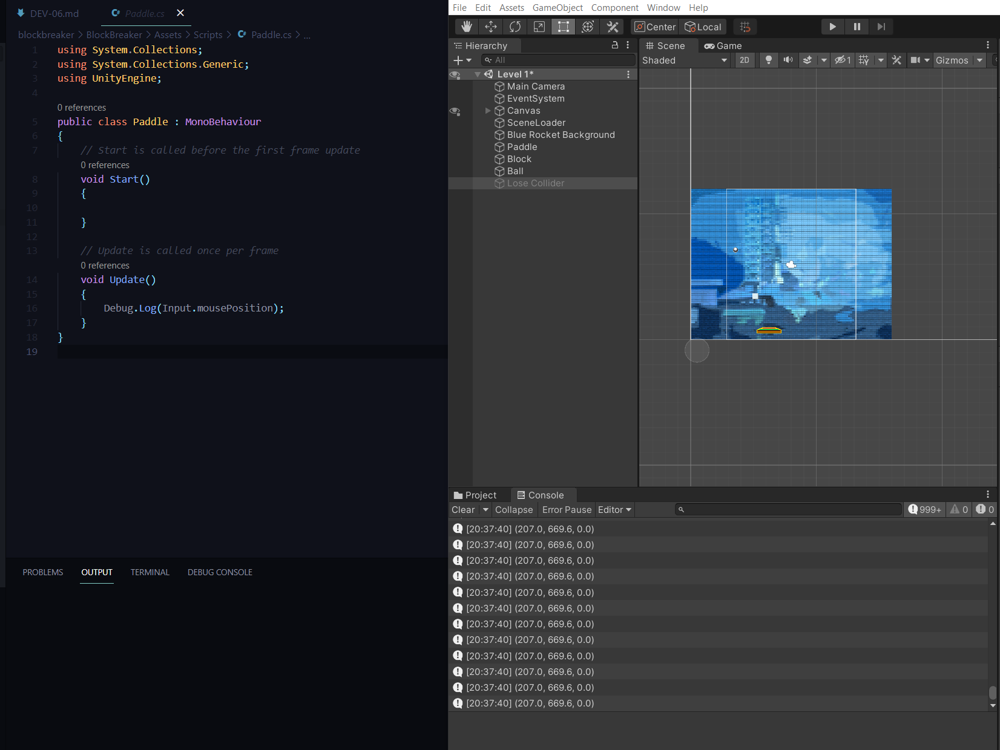
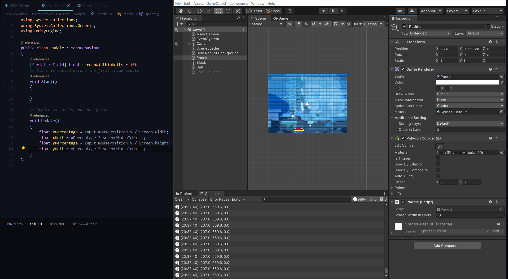
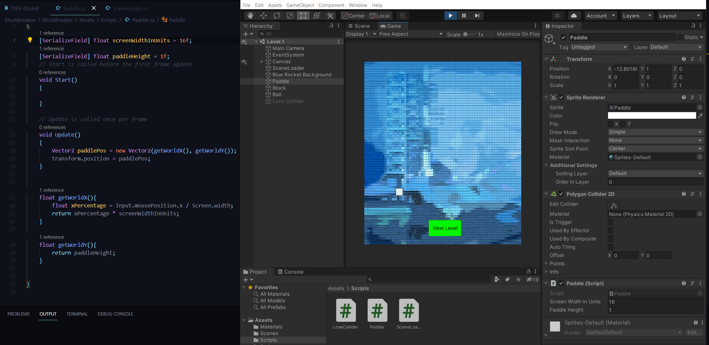

## DEV-06, Move Object With Mouse:
We want to move the paddle on the x axis in line with our cursor

Find the position of the mouse as it moves
convert thew mouse's position into world units
update the paddle's position to be whatever the mouse's position currently is

### Get the postion of the mouse
first x
second y
third z

Serializing worldUnits and turning our numerical xy into block world units

Vector2 is a compact way of storing x and y coordinates

