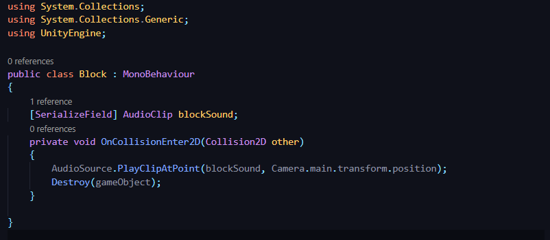
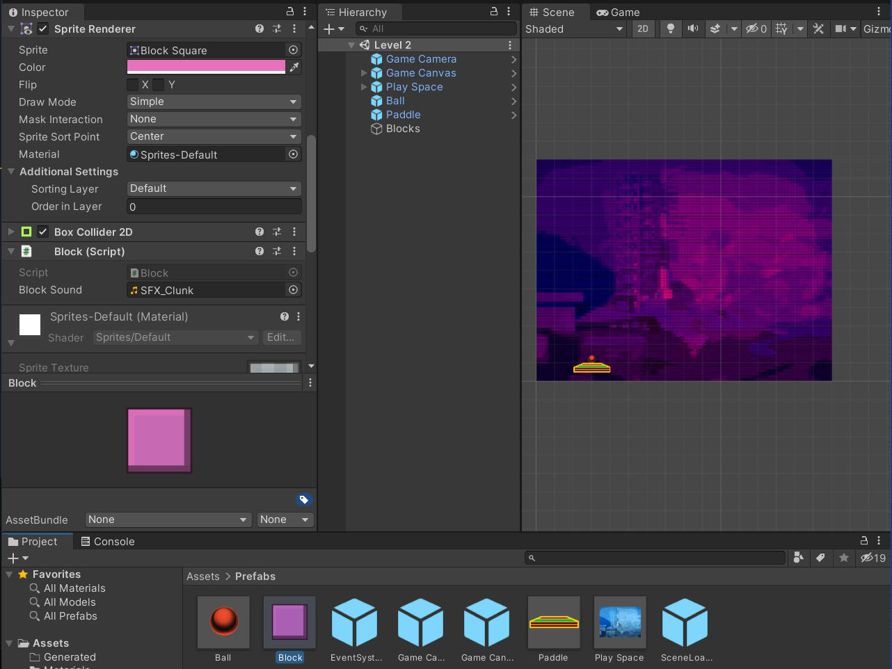

## DEV-17, Playing Sounds after a gameObject has been destroyed

https://docs.unity3d.com/ScriptReference/AudioSource.PlayClipAtPoint.html

PlayClipAtPoint allows us to create a temporary Audio Source that does not belong to a specific Game Object