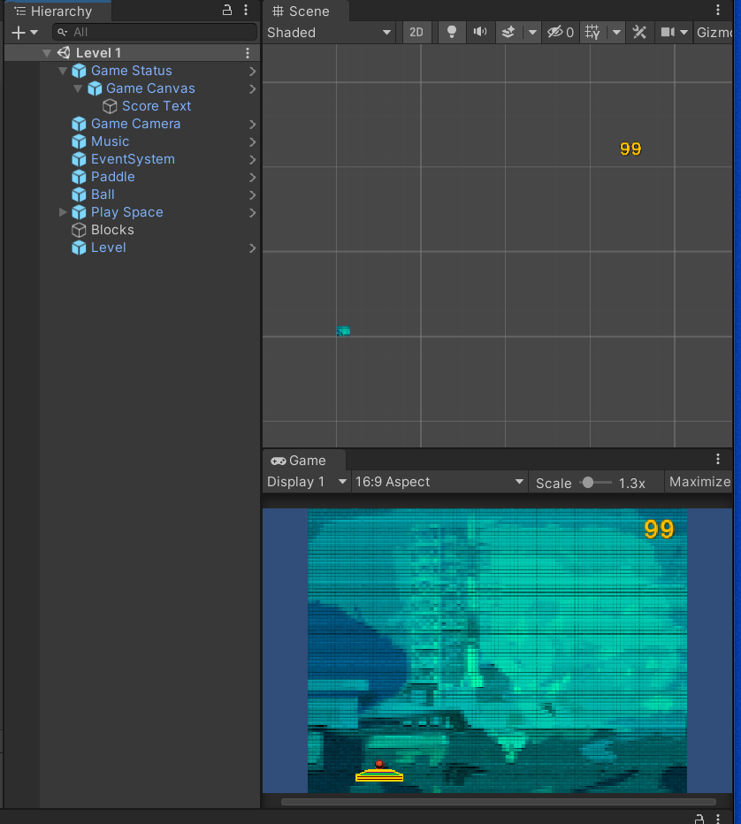
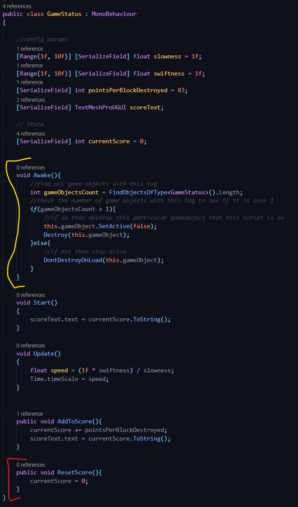
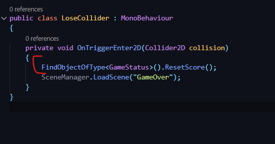

## DEV-23, Implementing the Singleton Pattern, make sure that the score does not get destroyed when going into the next level

https://docs.unity3d.com/Manual/ExecutionOrder.html

Yellow is what was worked on to make sure score persists
Red is what I attempted but failed in making score reset during game over, potentially in later lectures we will find out how to do this

