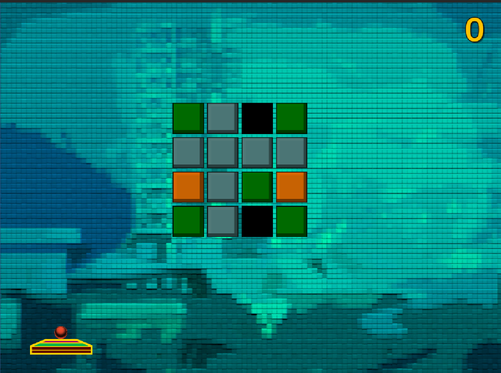
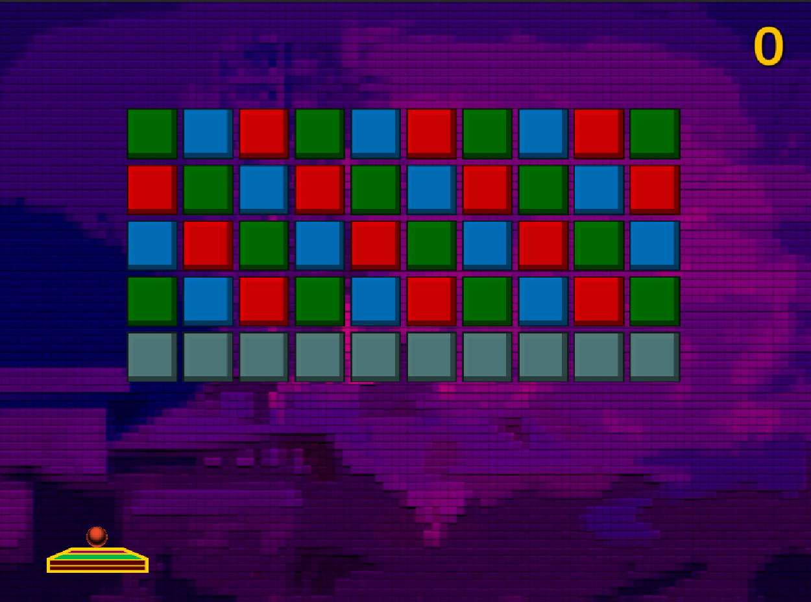
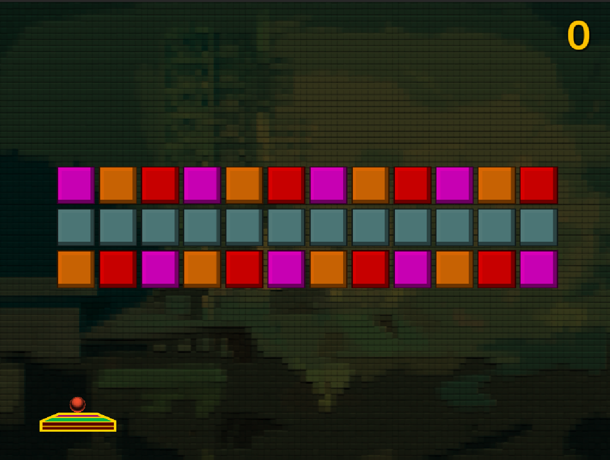

## DEV-26, Using tags in unity, unbreakable block

https://docs.unity3d.com/Manual/Tags.html

Added unbreakable blocks and a third level

Made it possible to do minor block level designing with auto generation cause i was not gonna build these blocks one by one

