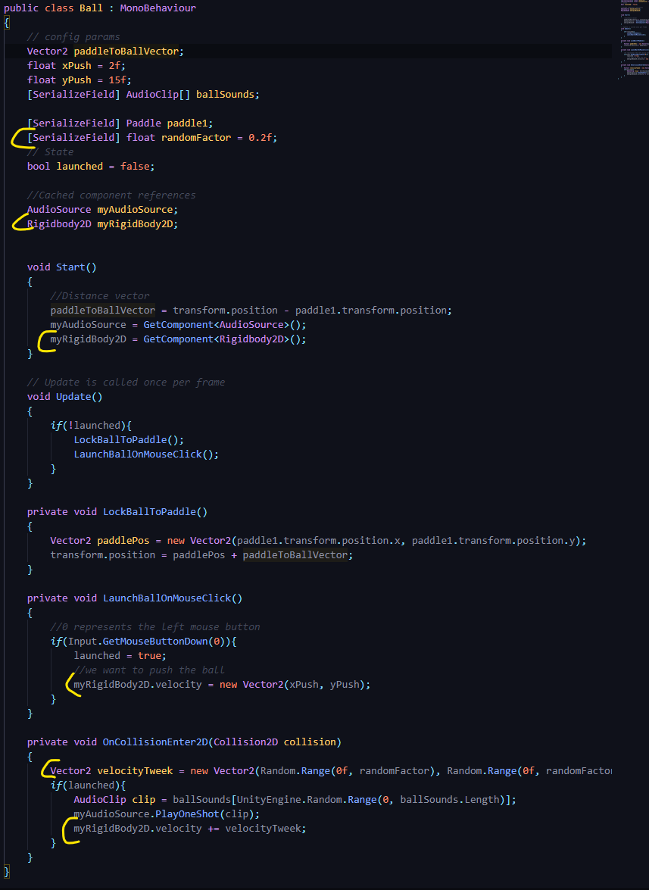
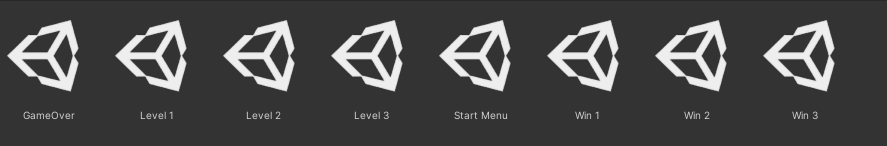
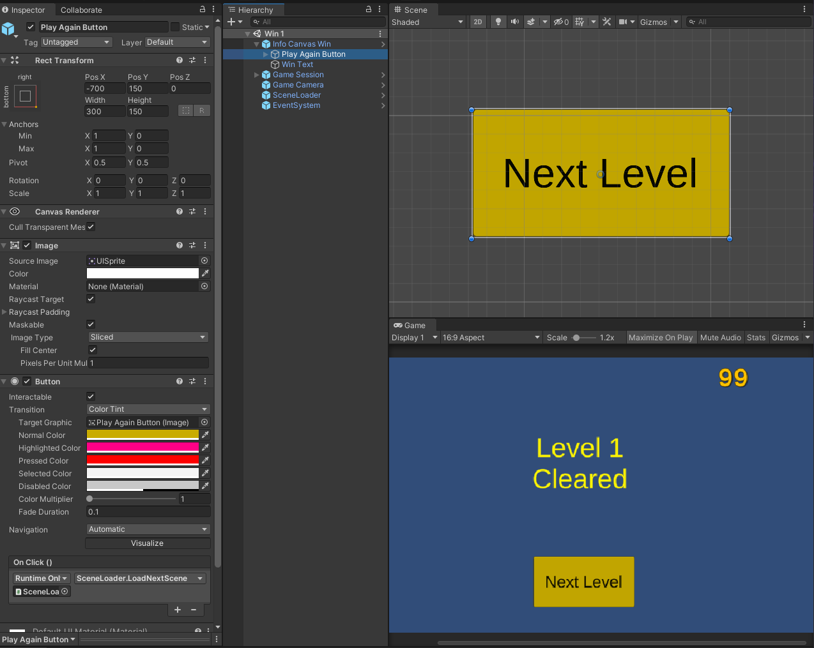
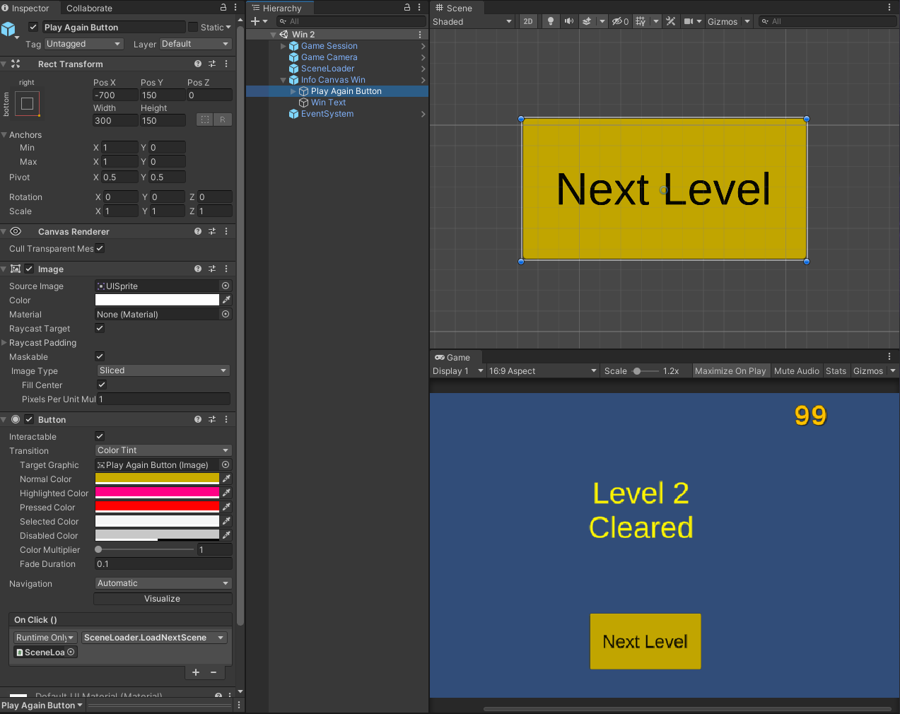
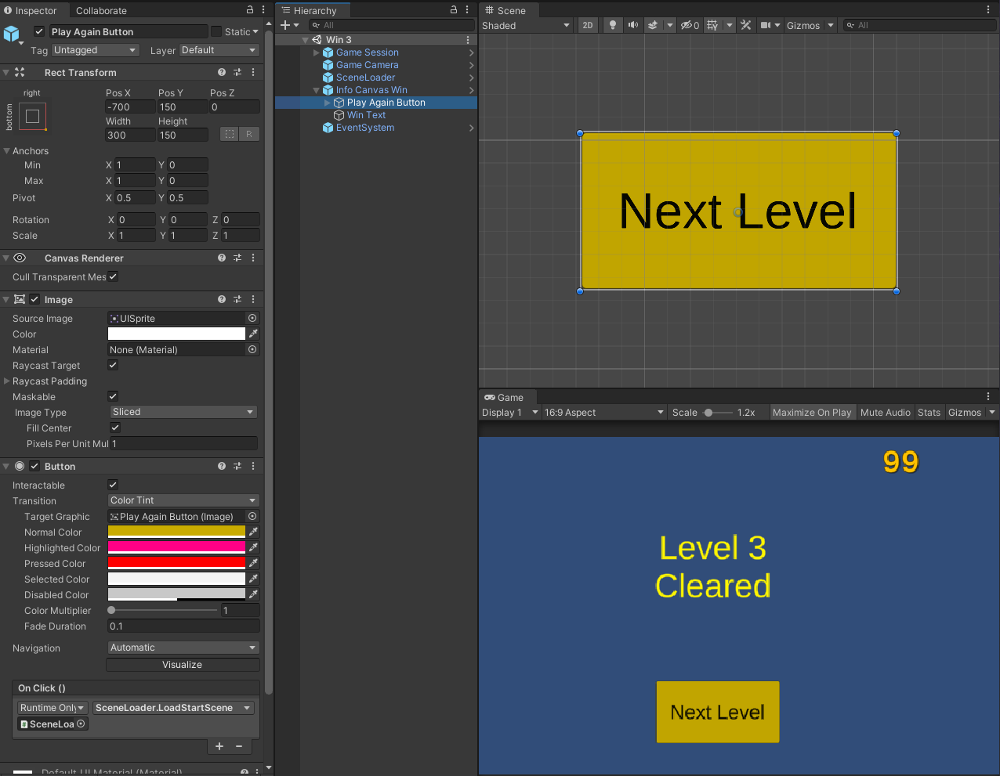

## DEV-29, some tweeking

Made it so that the ball isnt shifting back in forth in the sam direction for too long
also added win screens after each level
added scen loader object to each of the new scenes
and made sure that the buttons navigated using the appropriate functions of sceneloader

